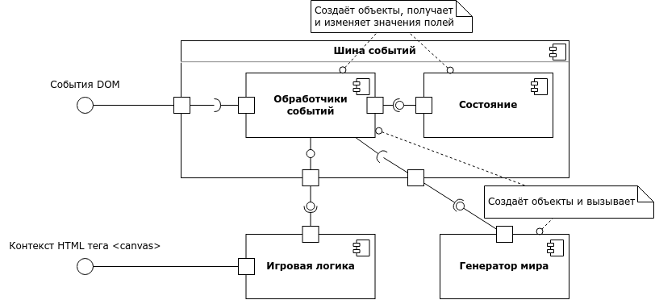
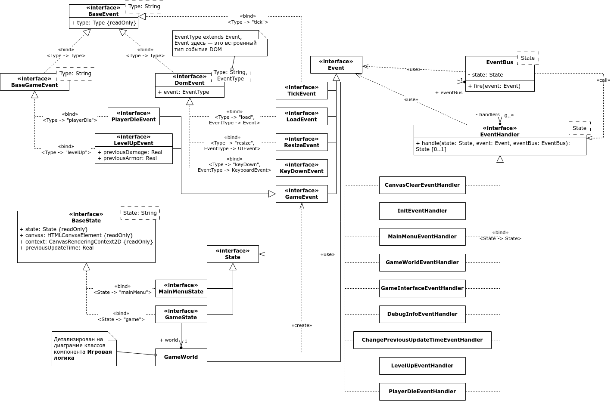
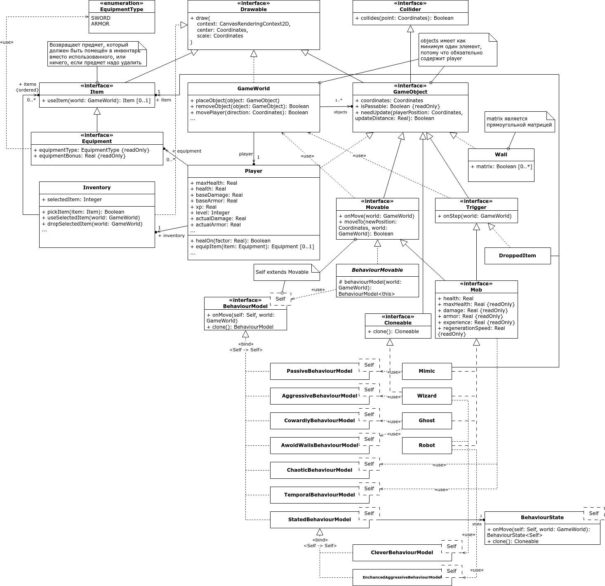

# Roguelike

## Команда

- Илья Иванцов
- Доморацкий Эридан

## Архитектурная документация

### Служебная информация

**Название:** Roguelike

**Авторы:** Доморацкий Эридан, Иванцов Илья

**Дата:** 08.06.2023

### Общие сведения о системе

#### Назначение системы

Система является однопользовательской пошаговой игрой в жанре roguelike с видом сверху,
доступной для использования с помощью Web-браузера. Пользовательский интерфейс предоставляется
в графическом виде с управлением при помощи клавиатуры и без использования мыши.

#### Описание границ системы

- Система является игрой
- Жанр игры roguelike
- Система однопользовательская (никакие два пользователя не могут коммуницировать
  посредством использования системы)
- Система предоставляет графический пользовательский интерфейс с тайловой графикой
- Управление игровым процессом происходит исключительно с помощью клавиатуры
- Внутриигровой мир двумерный
- Игра является пошаговой, все игровые механики срабатывают исключительно во время хода игрока
- Внутриигровые механики не используют технологии искуственного интеллекта, все действия
  определяются детерминировано или с использованием генератора псевдо-случайных чисел
- Все игровые объекты привязаны к целочисленной координатной сетке, как местоположение,
  так и размеры
- Система не использует звуковое сопровождение, никакие звуки не проигрываются на компьютере в
  связи с использованием системы

#### Описание контекста

- Система работает в рамках одной web-страницы
- Система не использует никакие устройства ввода, кроме клавиатуры

### Ключевые требования (architectural drivers)

#### Технические ограничения

- Система должна быть доступна для использования посредством Web-браузера
- Для использования системы не требуется никакое прикладное ПО, кроме Web-браузера
- Система не должна использовать никакие устройства ввода, кроме клавиатуры
- Система не должна воспроизводить звуки

#### Бизнес-ограничения

- Разработка системы должна быть завершена к моменту сдачи экзамена (12.06.2023)

#### Ключевые функциональные требования

- Система является игрой в жанре roguelike
- Игра является пошаговой, все игровые механики срабатывают исключительно во время хода игрока
- Должна быть доступна генерация случайного мира и загрузка из файла

### Роли и случаи использования

Для пользователей системы предусмотрена единственная роль Игрок.

В начале работы с системой Игрок выбирает тип генарации игрового мира: случайный или
загруженный из файла. После выбора система генерирует мир в соответствии с выбранным вариантом и
предоставляет доступ к управлению персонажем в игровом мире.

В игровом мире Игрок может управлять:
- перемещением персонажа (ходить вверх, вниз, вправо или влево),
- подбирать предметы, расположенные в игровом мире,
- использовать предметы, находящиеся в инвентаре,
- выбрасывать предметы из инвентаря в игровой мир,
- экипировать предметы из инвентаря.

Также Игрок должен иметь возможность получить информацию о текущем содержимом инвентаря,
экипированных предметах, текущих характеристиках (здоровье, сила атаки, броня) и видеть игровой
мир, окружающий персонажа.

### Контекст

Система является однопользовательской игрой в жанре roguelike с двумерной тайловой графикой,
управляемой с клавиатуры. Игровой мир также является двумерным, игрок видит мир сверху.
Игра является пошаговой, поэтому все внутриигровые механики действуют только в момент хода игрока.
В игровом мире должны присутствовать предметы, которые игрок может подобрать, после чего они
появляются в его инвентаре. Любой предмет в инвентаре может быть выброшен в игровой мир, либо
использован. Действие, сопровождающее использование предмета, зависит от типа предмета.
В игре должны присутствовать предметы, которые персонаж может надеть на себя в качестве экипировки,
при этом надетые предметы должны влиять на характеристики персонажа. Персонаж должен обладать
такими характеристиками, как здоровье, сила урона и защита. Персонаж может свободно перемещаться
по игровому миру, за исключением позиций, в которых стоит непреодолимое препятствие (например,
стена). Игровой мир представляется как условно-бесконечная (не ограниченная ничем, кроме
технических ограничений среды исполнения) целочисленная координатная сетка, поэтому все игровые
объекты, в том числе персонаж, могут находиться только на целочисленных позициях и иметь
целочисленный размер, выражающийся в количестве клеток коорднатной плоскости. Игрок должен иметь
возможность узнать текущие характеристики персонажа.

### Композиция

На верхнем уровне абстракции систему можно рассматривать как два компонента: шина событий и
игровая логика.

**Шина событий (event bus)** предназначена для обмена общесистемными событиями, такими как события
web-браузера. Также сюда входят текущее состояние и обработчики событий. Обработчики событий
выполняют роль контроллеров (аналогия из MVC), полностью отделяя игровую логику от особенностей
среды исполнения. Текущее состояние используется обработчиками событий для хранения общего
(распределённого между обработчиками) состояния, например, текущего игрового мира.

**Игровая логика** включает в себя непосредственно всю игровую логику и также логику отображения
игровых объектов на экране. Точкой входа в игру является игровой мир, который содержит в себе всю
игровую информацию, а внутри него расположены более простые игровые объекты.

**Генератор мира** отвечает за различные способы генерации игрового мира и игровых объектов.
В частности он предоставляет возможность сгенерировать мир случайно или загрузить из файла.

### Логическая структура

Вне компонентов существует инициализирующий скрипт, создающий экземпляры компонентов и
настраивающий их, а также преобразовывающий DOM-события в события **Шины событий**. Скрипт
загружается во время загрузки страницы (не после полной загрузки, а непосредственно во время)
с помощью HTML-тега script, расположенного в конце странице (чтобы на момент запуска HTML-тег
canvas уже был доступен в DOM).

#### Шина событий

Компонент **Шина событий** состоит из классов, описывающих конкретные типы событий, которые
принимает на вход класс **EventBus** и передаёт конкретным обработчикам событий, классы которых
также включены в этот компонент. Также определено несколько классов состояний, которые может
содержать объект **EventBus**. Все обработчики событий реализуют интерфейс **EventHandler**.

Типы событий:

- **BaseEvent** — базовый интерфейс для всех событий,
- **DomEvent** — базовый интерфейс для всех событий DOM,
- **LoadEvent**, **ResizeEvent** — события, отправляющиеся при возникновении DOM-событий
  загрузки и изменения размера окна, служат для обновления конфигурации HTML-тега canvas,
- **KeyDownEvent** — событие, отправляющееся при нажатии клавиши на клавиатуре,
- **TickEvent** — событие, отправляющееся каждую 60-тую долю секунды, служит для воспроизведения
  анимаций и отрисовки кадров,
- **Event** — общий тип для всех событий конкретного типа.

Типы состояний:

- **BaseState** — базовый интерфейс для всех типов состояний,
- **GameState** — тип состояния, использующегося во время игры,
- **MainMenuState** — тип состояния, использующегося для главного меню игры,
- **State** — общий тип для всех состояний конкретного типа.

Обработчики событий:

- **CanvasClearEventHandler** — реагирует на событие **TickEvent** и очищает холст для рисования
  нового кадра,
- **InitEventHandler** — реагирует на события **LoadEvent** и **ResizeEvent** и изменяет размеры
  HTML-тега canvas в соответствии с текущим размером окна,
- **MainMenuEventHandler** — отвечает за работу с главным меню игры,
- **GameWorldEventHandler** — отвечает за отрисовку игрового мира и перемещение персонажа,
- **GameInterfaceEventHandler** — отвечает за отрисовку игрового интерфейса (инвентарь и
  характеристики персонажа) и работу управление инвентарём персонажа,
  а также за выход в главное меню,
- **DebugInfoEventHandler** — отвечает за отображение и скрытие отладочной информации,
- **ChangePreviousUpdateTimeEventHandler** — реагирует на событие **TickEvent** и обновляет
  значение времени, когда был нарисован предыдущий кадр, которое используется для отрисовки
  анимаций.

#### Игровая логика

Компонент **Игровая логика** состоит из классов, описывающих игру (доменная модель).

Точкой входа является класс **GameWorld**, обладающий полной информации обо всём игровом мире.
Он содержит в себе список объектов, расположенных в игровом мире, включая объект персонажа.
Также игровой мир реализует интерфейс **Drawable**.

Интерфейс **Drawable** предоставляет единственный метод *draw*, отвечающий за рисование объекта
на холсте.

Интерфейс **Collider** предоставляет единственный метод *collides*, отвечающий на вопрос,
пересекает ли объект заданную точку в игровом мире.

Для представления точек, векторов и габаритов в двумерном пространстве используется утилитарный
класс **Coordinates**, который не входит в компонент **Игровая логика**. Класс предоставляет
свойства *x* и *y*, а также набор утилитарных методов для операций над координатами, который
будет определяться по необходимости программистом.

Все игровые объекты реализуют интерфейс **GameObject**, который, в свою очередь, наследуется от
интерфейсов **Drawable** и **Collider**. Кроме этого интерфейс предоставляет свойства
*coordinates*, содержащее текущее местоположение объекта в игровом мире (его левый верхний угол),
и *isPassable*, отвечающее на вопрос, может ли другой объект проходить сквозь объект (например,
для стен это свойство имеет истинное значение, а для предметов — ложное).

Типы игровых объектов:

- **Trigger** — интерфейс, определяющий игровой объект, реагирующий на соприкосновение с
  персонажем (когда персонаж оказывается на одной из клеток игрового мира, которую пересекает
  объект);
- **Player** — персонаж, содержит в себе инвентарь, текущее и максимальное значения здоровья,
  базовые значения силы атаки и брони, а также список экипированных предметов;
- **Wall** — стена, содержит булеву матрицу, определяющую форму стены (для оптимизации, чтобы
  каждая отдельная клетка стены не была отдельным объектом);
- **DroppedItem** — выборшенный предмет, содержит в себе предмет, реализует интерфейс **Trigger**.

Класс **Inventory** представляет инвентарь персонажа и содержит в себе список предметов и номер
текущего выбранного слота инвентаря. Список предметов и номер выбранного слота ограничены
количеством слотов инвентаря — девять. Предоставляет методы для взаимодействия с текущим предметом
и изменения номера выбранного слота.

Интерфейс **Item** является общим для всех предметов, расширяет интерфейс **Drawable**,
предоставляет метод *useItem*, реализующий использование предмета игроком.

Интерфейс **Equipment** расширяет интерфейс **Item** и является общим для всех предметов, которые
можно экипировать. Предоставляет свойства *equipmentType* и *equipmentBonus*, показывающие, на
какие характеристики персонажа и каким образом влияет экипировка предмета.

Типы предметов:

- **GoldenApple** — предмет, увеличивающий показатель здоровья персонажа на 0.2 от максимального
  здоровья при использовании;
- **Sword** — предмет, который при экипировке добавляет пять единиц к силе атаки персонажа.

#### Генератор мира

Компонент **Генератор мира** содержит классы и интерфейсы для генерации игрового мира
и игровых объектов.

Интерфейс **Generator** предоставляет один метод *generate*, принимающий генератор случайных
чисел (для возможности параметризации зерна) и возвращающий сгенерированный объект.

Интерфейсы **ItemGenerator** и **WorldGenerator** специализируют **Generator** для предметов и
игрового мира соответственно.

Класс **UniformItemGenerator** позволяет генерировать предметы с заданным дискретным
распределением, которое описывается таблицей относительных вероятностей. Реальная вероятность
вычисляется как отношение относительной вероятности к сумме всех относительных вероятностей.

Класс **FileWorldGenerator** реализует детерминированный **WorldGenerator**, обрабатывающий
текст с описанием игрового мира, и строящий игровой мир исходя из текстового описания.

Класс **BoxedWorldGenerator** реализует **WorldGenerator**, генерирующий мир, состоящий из
одинаковых прямоугольных комнат, соединённых проходами. В каждой такой комнате может появиться
случайное количество предметов, которые генерируются с помощью **ItemGenerator**. Параметризуется
размером комнаты, максимальными количеством предметов в комнате, генератором предметов и
максимальной глубиной дерева генерации. Алгоритм генерации описан в точке зрения Алгоритмы.

<!-- TODO диаграмма классов -->

### Использование шаблонов

... паттерн цепочка обязанностей для event bus, паттерн композиция для drawable ...

### Интерфейсы

... наброски пользовательского интерфейса ...

### Взаимодействия

... передача событий от браузера к обработчикам, взаимодействие игрового мира с объектами
и наоборот ...

### Динамика состояний

... переход от главного экрана к игре и наоборот ...

### Алгоритмы

... алгоритм генерации мира ...

### Ресурсы

... шрифты из Google Fonts ...
