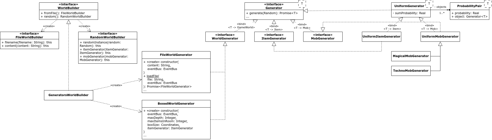
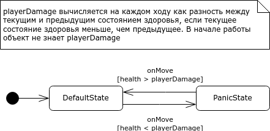
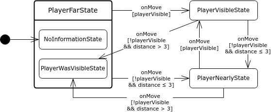

# Roguelike

## Команда

- Илья Иванцов
- Доморацкий Эридан

## Инструкция по сборке

Все указанные команды предполагается выполнять находясь в корневой директории проекта.

### Пререквизиты

Для сборки и запуска требуется следующее ПО:

- [Node.js](https://nodejs.org/ru)
- [Yarn](https://yarnpkg.com/)

### Подготовка к работе

Для начала работы с проектом необходимо установить зависимости:

```sh
yarn
```

### Запуск сервера разработки

Для ведения активной разработки удобно воспользоваться настроенным сервером разработки
с автоматической синхронизацией изменений:

```sh
yarn start
```

### Запуск тестов

Для запуска тестов настроена команда:

```sh
yarn test
```

### Сборка бандла

Для сборки проекта в самостоятельный набор файлов, готовый к открытию в браузере или развёртыванию,
предлагается следующая команда:

```sh
yarn build
```

### Очистка результатов сборки

Для очистки результатов сборки (удаления собранного бандла) настроена команда:

```sh
yarn clean
```

### Развёртывание

В проекте настроена команда для автоматического развёртывания проекта
по адресу https://roguelike.byprogminer.ru
или https://progminer.github.io/Lab_SoftwareDevelopment/index.html:

```sh
yarn deploy
```

Однако предложенная команда будет работать только при наличии доступа к репозиторию на запись.

## Архитектурная документация

### Служебная информация

**Название:** Roguelike

**Авторы:** Доморацкий Эридан, Иванцов Илья

**Дата:** 08.06.2023

### Общие сведения о системе

#### Назначение системы

Система является однопользовательской пошаговой игрой в жанре roguelike с видом сверху,
доступной для использования с помощью Web-браузера. Пользовательский интерфейс предоставляется
в графическом виде с управлением при помощи клавиатуры и без использования мыши.

#### Описание границ системы

- Система является игрой
- Жанр игры roguelike
- Система однопользовательская (никакие два пользователя не могут коммуницировать
  посредством использования системы)
- Управление игровым процессом происходит исключительно с помощью клавиатуры
- Внутриигровой мир двумерный
- Игра является пошаговой, все игровые механики срабатывают исключительно во время хода игрока
- Внутриигровые механики не используют технологии искуственного интеллекта, все действия
  определяются детерминировано или с использованием генератора псевдо-случайных чисел
- Все игровые объекты привязаны к целочисленной координатной сетке, как местоположение,
  так и размеры
- Система не использует звуковое сопровождение, никакие звуки не проигрываются на компьютере в
  связи с использованием системы
- Система не предназначена для работы на мобильных устройствах (и на устройствах без аппаратной
  клавиатуры или с размером монитора менее 1366x768)

#### Описание контекста

- Система работает в рамках одной web-страницы
- Система не использует никакие устройства ввода, кроме клавиатуры

### Ключевые требования (architectural drivers)

#### Технические ограничения

- Web-браузер должен поддерживать CanvasRenderingContext2D API
- Web-браузер должен поддерживать ECMAScript 5

#### Бизнес-ограничения

- Разработка системы должна быть завершена к моменту сдачи экзамена (12.06.2023)

#### Качественные характеристики системы

- Высокая сопровождаемость системы, архитектура должна быть устойчива к внедрению новых
  функциональных возможностей (типов игровых объектов, игровых механик)
- Производительность, достаточная для комфортной работы (без видимых проблем с частотой кадров
  и реакцией на пользовательский ввод) на компьютере с процессором Intel Core i5 8th Gen
- Объём потребляемой памяти открытой вкладкой в Web-браузере не должен превышать 1 Гб
- Хорошая тестируемость системы, компоненты должны быть спроектированы и реализованы так,
  чтобы трудозатраты на написание unit-тестов не превосходили трудозатрат на реализацию

#### Ключевые функциональные требования

- Система предоставляет графический пользовательский интерфейс с тайловой графикой
- В игре должен присутствовать ровно один персонаж, управляемый при помощи клавиатуры
- В игре должны присутствовать предметы экипировки, влияющие на характеристики персонажа
- Должна быть доступна генерация случайного мира и загрузка из файла
- В игре должны присутствовать враждебные существа, с которыми игровой персонаж может
  вступить в бой
- Бой происходит автоматически, исходя из игровых характеристик персонажа

#### Нефункциональные требования

- Визуальная составляющая игры должна быть реализована с использованием изображений (текстур),
  а не только с помощью графических примитивов
- Вид на игрока должен быть анимирован, "камера" должна перемещаться не мгновенно
- Текущее количественное значение здоровья игрока должно выводиться на экран красным цветом
- Перемещение персонажа должно происходить при помощи клавиш W, A, S, D
- Формат файла игрового мира должен быть человеко-читаемым для возможности ручного редактирования
  в текстовом редакторе

### Роли и случаи использования

Предусмотрены следующие роли:

- Игрок
- Дизайнер миров

Ниже описываются случаи использования каждой из этих ролей.

#### Игрок

- Играть в случайно сгенерированном мире
- Играть в мире, загруженном из файла
- Управлять перемещением персонажа в игровом мире
- Подбирать предметы из игрового мира и выбрасывать их в игровой мир
- Использовать и экипировать предметы, находящиеся в инвентаре
- Узнать текущее и максимальное значение здоровья
- Узнать текущее значение силы атаки и брони
- Узнать текущее местоположение персонажа относительно игровых объектов, расположенных неподалёку

#### Дизайнер миров

Роль расширяет роль Игрок.

- Создавать игровые миры путём редактирования файла в текстовом редакторе

### Описание типичного пользователя


**Сергеев Иван Ильич**, мужчина, 25 лет

Любит игры в жанре roguelike. Много играет в современные компьютерные игры, поэтому привык
управлять персонажем с помощью клавиш W, A, S, D. Любит шахматы, поэтому более расположен к
пошаговым играм и автоматическим боям. Без ума от плавающих камер в играх. Хотел бы видеть
себя в образе главного героя игры. Очень любит майнкрафт и мод Giselbaer's Durability Viewer.

### Контекст

Система является однопользовательской игрой в жанре roguelike с двумерной тайловой графикой,
управляемой с клавиатуры. Игровой мир также является двумерным, игрок видит мир сверху.
Игра является пошаговой, поэтому все внутриигровые механики действуют только в момент хода игрока.
В игровом мире должны присутствовать предметы, которые игрок может подобрать, после чего они
появляются в его инвентаре. Любой предмет в инвентаре может быть выброшен в игровой мир, либо
использован. Действие, сопровождающее использование предмета, зависит от типа предмета.
В игре должны присутствовать предметы, которые персонаж может надеть на себя в качестве экипировки,
при этом надетые предметы должны влиять на характеристики персонажа. Персонаж должен обладать
такими характеристиками, как здоровье, сила урона и защита. Персонаж может свободно перемещаться
по игровому миру, за исключением позиций, в которых стоит непреодолимое препятствие (например,
стена). Игровой мир представляется как условно-бесконечная (не ограниченная ничем, кроме
технических ограничений среды исполнения) целочисленная координатная сетка, поэтому все игровые
объекты, в том числе персонаж, могут находиться только на целочисленных позициях и иметь
целочисленный размер, выражающийся в количестве клеток коорднатной плоскости. Игрок должен иметь
возможность узнать текущие характеристики персонажа. Также в игровом мире присутствуют враждебные
существа, с которыми игрок может вступать в бой. Исход боя рассчитывается автоматически исходя из
игровых характеристик персонажа и враждебного существа. После убийства враждебного существа
игрок должен получить определённое количество единиц опыта. При наборе достаточного количества
единиц опыта игрок получает новый уровень, что влияет на его силу атаки и броню.

### Композиция

На верхнем уровне абстракции систему можно рассматривать как два компонента: шина событий и
игровая логика.

**Шина событий (event bus)** предназначена для обмена общесистемными событиями, такими как события
web-браузера. Также сюда входят текущее состояние и обработчики событий. Обработчики событий
выполняют роль контроллеров (аналогия из MVC), полностью отделяя игровую логику от особенностей
среды исполнения. Текущее состояние используется обработчиками событий для хранения общего
(распределённого между обработчиками) состояния, например, текущего игрового мира.

**Игровая логика** включает в себя непосредственно всю игровую логику и также логику отображения
игровых объектов на экране. Точкой входа в игру является игровой мир, который содержит в себе всю
игровую информацию, а внутри него расположены более простые игровые объекты.

**Генератор мира** отвечает за различные способы генерации игрового мира и игровых объектов.
В частности он предоставляет возможность сгенерировать мир случайно или загрузить из файла.


### Логическая структура

Вне компонентов существует инициализирующий скрипт, создающий экземпляры компонентов и
настраивающий их, а также преобразовывающий DOM-события в события **Шины событий**. Скрипт
загружается во время загрузки страницы (не после полной загрузки, а непосредственно во время)
с помощью HTML-тега script, расположенного в конце странице (чтобы на момент запуска HTML-тег
canvas уже был доступен в DOM).

#### Шина событий

Компонент **Шина событий** состоит из классов, описывающих конкретные типы событий, которые
принимает на вход класс **EventBus** и передаёт конкретным обработчикам событий, классы которых
также включены в этот компонент. Также определено несколько классов состояний, которые может
содержать объект **EventBus**. Все обработчики событий реализуют интерфейс **EventHandler**.

Типы событий:

- **BaseEvent** — базовый интерфейс для всех событий,
- **DomEvent** — базовый интерфейс для всех событий DOM,
- **LoadEvent**, **ResizeEvent** — события, отправляющиеся при возникновении DOM-событий
  загрузки и изменения размера окна, служат для обновления конфигурации HTML-тега canvas,
- **KeyDownEvent** — событие, отправляющееся при нажатии клавиши на клавиатуре,
- **TickEvent** — событие, отправляющееся не чаще, чем 60 раз в секунду,
  служит для воспроизведения анимаций и отрисовки кадров,
- **BaseGameEvent** — базовый интерфейс для всех внутриигровых событий,
- **PlayerDieEvent** — событие смерти игрока,
- **LevelUpEvent** — событие увеличения уровня игрока,
- **GameEvent** — общий тип для всех внутриигровых событий конкретного типа,
- **Event** — общий тип для всех событий конкретного типа.

**TickEvent** отправляется регулярно для того, чтобы все анимации могли быть воспроизведены
при условии, что каждый кадр анимации отображается во время обработки очередного **TickEvent**.
Гарантируется, что событие не будет отправляться чаще, чем 60 раз в секунду.

Предполагается, что **GameEvent** отправляются только из компонента **Игровая логика**.

Типы состояний:

- **BaseState** — базовый интерфейс для всех типов состояний;
- **MainMenuState** — тип состояния, использующегося для главного меню игры;
- **BaseGameState** — базовый интерфейс для всех типов игровых состояний;
- **CommonGameState** — обычное игровое состояние;
- **PlayerDeadState** — игровое состояние после смерти игрового персонажа;
- **GameState** — общий тип для всех игровых состояний;
- **State** — общий тип для всех состояний конкретного типа.

Обработчики событий:

- **CanvasClearEventHandler** — реагирует на событие **TickEvent** и очищает холст для рисования
  нового кадра,
- **InitEventHandler** — реагирует на события **LoadEvent** и **ResizeEvent** и изменяет размеры
  HTML-тега canvas в соответствии с текущим размером окна,
- **MainMenuEventHandler** — отвечает за работу с главным меню игры,
- **GameWorldEventHandler** — отвечает за отрисовку игрового мира и перемещение персонажа,
- **GameInterfaceEventHandler** — отвечает за отрисовку игрового интерфейса (инвентарь и
  характеристики персонажа) и работу управление инвентарём персонажа,
  а также за выход в главное меню,
- **LevelUpEventHandler** — отвечает за отображение сообщения о получении игроком нового уровня,
- **PlayerDieEventHandler** — отвечает за переход в **PlayerDeadState** и отображение
  сообщения о смерти,
- **DebugInfoEventHandler** — отвечает за отображение и скрытие отладочной информации,
- **ChangePreviousUpdateTimeEventHandler** — реагирует на событие **TickEvent** и обновляет
  значение времени, когда был нарисован предыдущий кадр, которое используется для отрисовки
  анимаций.


#### Игровая логика

Компонент **Игровая логика** состоит из классов, описывающих игру (доменная модель).

Точкой входа является класс **GameWorld**, обладающий полной информации обо всём игровом мире.
Он содержит в себе список объектов, расположенных в игровом мире, включая объект персонажа.
Также игровой мир реализует интерфейс **Drawable**.

Интерфейс **Drawable** предоставляет единственный метод *draw*, отвечающий за рисование объекта
на холсте.

Интерфейс **Collider** предоставляет единственный метод *collides*, отвечающий на вопрос,
пересекает ли объект заданную точку в игровом мире.

Для представления точек, векторов и габаритов в двумерном пространстве используется утилитарный
класс **Coordinates**, который не входит в компонент **Игровая логика**. Класс предоставляет
свойства *x* и *y*, а также набор утилитарных методов для операций над координатами, который
будет определяться по необходимости программистом.

Все игровые объекты реализуют интерфейс **GameObject**, который, в свою очередь, наследуется от
интерфейсов **Drawable** и **Collider**. Кроме этого интерфейс предоставляет свойства
*coordinates*, содержащее текущее местоположение объекта в игровом мире (его левый верхний угол),
и *isPassable*, отвечающее на вопрос, может ли другой объект проходить сквозь объект (например,
для стен это свойство имеет ложное значение, а для предметов — истинное). Также интерфейс
предоставляет метод *needUpdate*, проверяющий, нужно ли выполнять методы объекта в зависимости от
текущего местоположения игрока, предназначен для оптимизации.

Типы игровых объектов:

- **Trigger** — интерфейс, определяющий игровой объект, реагирующий на соприкосновение с
  персонажем (когда персонаж оказывается на одной из клеток игрового мира, которую пересекает
  объект);
- **Movable** — интерфейс, определяющий игровой объект, способный совершать действия во время
  (сразу после) хода игрока и «самовольно» перемещаться;
- **Mob** — интерфейс, определяющий игровой объект враждебного существа, расширяет **Movable**
  и **Trigger** для боя с игроком;
- **Cloneable** — интерфейс, определяющий игровой объект, способный создать свою копию;
- **Player** — персонаж, содержит в себе инвентарь, текущее и максимальное значения здоровья,
  базовые значения силы атаки и брони, текущее количество опыта и номер уровня,
  а также список экипированных предметов;
- **Wall** — стена, содержит булеву матрицу, определяющую форму стены (для оптимизации, чтобы
  каждая отдельная клетка стены не была отдельным объектом);
- **DroppedItem** — выборшенный предмет, содержит в себе предмет, реализует интерфейс **Trigger**;
- **BehaviourMovable** — абстрактный класс для **Movable** объектов, чьё поведение определяется
  каким-то **BehaviourModel**.

Класс **Inventory** представляет инвентарь персонажа и содержит в себе список предметов и номер
текущего выбранного слота инвентаря. Список предметов и номер выбранного слота ограничены
количеством слотов инвентаря — девять. Предоставляет методы для взаимодействия с текущим предметом
и изменения номера выбранного слота.

Интерфейс **Item** является общим для всех предметов, расширяет интерфейс **Drawable**,
предоставляет метод *useItem*, реализующий использование предмета игроком.

Интерфейс **Equipment** расширяет интерфейс **Item** и является общим для всех предметов, которые
можно экипировать. Предоставляет свойства *equipmentType* и *equipmentBonus*, показывающие, на
какие характеристики персонажа и каким образом влияет экипировка предмета.

Типы предметов:

- **GoldenApple** — предмет, увеличивающий показатель здоровья персонажа на 0.2 от максимального
  здоровья при использовании;
- **Sword** — предмет, который при экипировке добавляет пять единиц к силе атаки персонажа.

Интерфейс **Mob**, помимо расширения **Movable** и **Trigger**, предоставляет свойства
с характеристиками враждебного существа (текущее здоровье, максимальное здоровье, сила атаки,
броня, скорость регенерации), а также число единиц опыта, которые даются игроку за убийство
этого существа.

При бое с игроком происходит вычисление урона, наносимого игроку и враждебному существу.
После этого вычисленные значения вычитаются из значений здоровья, если они не меньше нуля. Если
после этого уровень здоровья враждебного существа становится меньше или равным нулю, существо
пропадает из игрового мира и игроку начисляется количество опыта, указанное в свойстве существа.
Если при этом количество игрока стало не меньше, чем необходимое для получения следующего уровня,
значение уровня игрока увеличивается на нужное число, после чего отправляется **LevelUpEvent**.
Если здоровье игрока становится меньше нуля, отправляется событие **PlayerDieEvent**. Затем, если
никто не умер, модель поведения враждебного существа декорируется при помощи модели поведения
**TemporalBehaviourModel** в совокупности с **ChaoticBehaviourModel**, заставляя враждебное
существо перемещаться случайно в течение одного хода.

Интерфейс **BehaviourModel** представляет некую модель поведения для **Movable** объекта.
Предоставляет методы: *onMove* — для вызова во время хода игрока и совершения хода объектом,
и *clone* — для создания копии объекта модели поведения.

Типы моделей поведения:

- **AggressiveBehaviourModel** — преследует персонаж игрока при прямом визуальном контакте,
- **AvoidWallsBehaviourModel** — ходит в случайном направлении, пока объект находится
  в непреодолимом препятствии,
- **ChaoticBehaviourModel** — ходит в случайном направлении,
- **CowardlyBehaviourModel** — идёт в противоположную от персонажа игрока сторону при прямом
  визуальном контакте,
- **PassiveBehaviourModel** — не двигается,
- **TemporalBehaviourModel** — применяет указанную модель поведения несколько ходов, после чего
  самостоятельно деактивируется, удаляя себя,
- **StatedBehaviourModel** — модель поведения, определяемая заданным конечным автоматом,
- **CleverBehaviourModel** — отбегает от игрока, если следующий удар станет для существа
  смертельным,
- **EnchancedAggressiveBehaviourModel** — усовершенствованная агрессивная модель поведения,
  подробнее в точке зрения Динамика состояний.

Типы враждебных существ:

- **Ghost** — может проходить сквозь непреодолимые препятствия, убегает от игрока,
- **Mimic** — принимает вид указанного предмета, стоит на месте,
- **Robot** — преследует игрока по **EnchancedAggressiveBehaviourModel**,
- **Wizard** — после боя с игроком может с некоторой вероятностью породить своего двойника.

Также **Robot** и **Wizard**, помимо своей основной модели поведения, используют
**CleverBehaviourModel**.


#### Генератор мира

Компонент **Генератор мира** содержит классы и интерфейсы для генерации игрового мира
и игровых объектов.

Интерфейс **Generator** предоставляет метод *generate*, принимающий генератор случайных
чисел (для возможности параметризации зерна) и возвращающий сгенерированный объект.

Интерфейсы **ItemGenerator**, **MobGenerator** и **WorldGenerator** специализируют **Generator**
для предметов, враждебных существ и игрового мира соответственно.

Класс **UniformGenerator** позволяет генерировать объекты с заданным дискретным распределением,
которое описывается таблицей относительных вероятностей. Реальная вероятность вычисляется как
отношение относительной вероятности к сумме всех относительных вероятностей. Параметризуется
конкретным объектом. Классы **UniformItemGenerator** и **UniformMobGenerator** специализируют
генератор для предметов и враждебных существ соответственно.

Классы **MagicalMobGenerator** и **TechnoMobGenerator** наследуют **UniformMobGenerator**,
уточняя конкретные классы генерируемых существ.

Класс **FileWorldGenerator** реализует детерминированный **WorldGenerator**, обрабатывающий
текст с описанием игрового мира, и строящий игровой мир исходя из текстового описания. Формат
файла описан в точке зрения Информационная структура.

Класс **BoxedWorldGenerator** реализует **WorldGenerator**, генерирующий мир, состоящий из
одинаковых прямоугольных комнат, соединённых проходами. В каждой такой комнате может появиться
случайное количество предметов, которые генерируются с помощью **ItemGenerator**. Параметризуется
размером комнаты, максимальными количеством предметов в комнате, генератором предметов и
максимальной глубиной дерева генерации. Алгоритм генерации описан в точке зрения Алгоритмы.

Интерфейс **WorldBuilder** предоставляет два метода *fromFile* и *random*, возвращающие объекты
интерфейсов **FileWorldBuilder** и **RandomWorldBuilder** соответственно. Перечисленные интерфейсы
позволяют пошагово конфигурировать генерируемый мир с последующим созданием.

Класс **GeneratorsWorldBuilder** реализует **WorldBuilder**, основанный на **FileWorldGenerator**
и **BoxedWorldGenerator**.



### Информационная структура

#### Формат файла игрового мира

Описание синтаксиса файла игрового мира для **FileWorldGenerator** в РБНФ:

```ebnf
File = WorldSize Walls { HoleFiller }.
WorldSize = Nat Nat "\n".
Walls = { WallsRow }.
WallsRow = { WallsCell } "\n".
WallsCell = "W" | "." | Nat.
HoleFiller = Nat "." HoleFillerName HoleFillerData "\n".
HoleFillerName = "Player" | "Item".
```

- `Nat` — любое натуральное число
- `HoleFillerData` — `[^\n]*`

Также требуется, чтобы число `WallsRow` в `Walls` совпадало со вторым числом в `WorldSize`
(высота мира) и число `WallsCell` в каждом `WallsRow` совпадало с первым числом в `WorldSize`
(ширина мира). Первым числом в `HoleFiller` может быть только одно из чисел, содержащихся в
качестве значения `WallsCell`. Предполагается, что все номера упоминаются в качестве `WallsCell`
единожды (если это не так, учитывается лишь последнее упоминание).

Семантика:

- Первая строка задаёт ширину и высоту мира.
- `W` в ячейке мира задаёт стену.
- `.` в ячейке мира задаёт пустоту.
- Число в ячейке мира задаёт "hole", который можно заполнить с помощью нуля,
  одного или нескольких заполнителей.
- Заполнитель `Player` размещает в указанном "hole" персонажа.
  Если используется больше одного раза, приоритет отдаётся последнему,
  если не используется ни разу, персонаж размещается в позиции $`(0, 0)`$.
- Заполнитель `Item` требует в качестве `HoleFillerData` значение `Sword` или `GoldenApple` и
  размещает в "hole" соответствующий предмет.

### Использование шаблонов

Реализации интерфейса **Drawable** образуют вложенную структуру и следуют структурному шаблону
проектирования Компоновщик. Так, объект класса **GameWorld** включает в себя множество объектов
типа **GameObject**, среди которых есть игрок и могут быть объекты класса **DroppedItem**.
Каждый **DroppedItem** содержит в себе **Item**, что позволяет использовать метод *draw* вложенных
объектов при отрисовке менее вложенных. Аналогично, при отрисовке **Inventory** используются методы
*draw* предметов, хранящихся в нём.

Компонент **Шина событий** реализует шаблон Посредник, где класс **EventBus** выступает в роли
посредника. Таким образом, из любой части системы может быть отправлено событие, которое оповестит
все части системы.

### Взаимодействия

#### Распространение события

При отправке события в **Шину событий** оно распространяется по всем обработчикам в определённой
последовательности, не меняющейся от события к событию.


#### Отрисовка игрового мира

При обработке события **TickEvent** обработчиком **GameWorldEventHandler** выполняется отрисовка
игрового мира.

Ниже проиллюстрирован пример отрисовки части игрового мира, в котором размещён **DroppedItem** и
**Wall**.


### Динамика состояний

Система в явном виде содержит конечный автомат состояний **Шины событий**.


#### CleverBehaviourModel



#### EnchancedAggressiveBehaviourModel

Исходно объект находится в состоянии неведения. В этом состоянии он бродит случайным образом.

Затем, если игрок находится в прямой видимости, объект переходит в состояние **PlayerVisibleState**.

Если игрок не виден, но расстояние до него не больше, чем 3 игровые ячейки, объект переходит
в состояние **PlayerNearlyState**. Это имитирует возможность «слышать» игрока неподалёку.

Если игрок не виден и не слышен, а мы его ранее видели или слышали, то объект переходит в состояние
**PlayerWasVisibleState**.

Во всех состояниях, кроме исходного, объект движется в сторону игрока.



### Алгоритмы

#### BoxedWorldGenerator

Алгоритм состоит из двух основных этапов: генерация модели данных и формирование мира.

Псевдокод работы первого этапа:

```python
def generateBoxes(random, maxDepth, maxItemsInRoom, itemGenerator):
    result := Map() # отображение из координат комнаты в комнату

    queue := Queue() # создаём пустую очередь
    queue.push(((0, 0), 0)) # добавляем комнату на координатах (0, 0) на глубине обхода 0

    while queue ≠ ø:
        box, depth := queue.pop() # извлекаем очередную комнату из очереди

        # генерируем целое число из отрезка [0, maxItemsInRoom]
        itemsNumber := random.nextInt(0, maxItemsInRoom)

        # генерируем itemsNumber случайных предметов
        items := { itemGenerator.generate(random) | i <- [0, itemsNumber) }

        # если ещё можем углубляться
        if depth < maxDepth:

            # случайное число проходов от 0 до 4 включительно
            doorsNumber := random.nextInt(0, 4)

            # выбираем в какую сторону будут проходы
            doors := random.sample(doorsNumber, {
                (box.x, box.y - 1),
                (box.x, box.y + 1),
                (box.x - 1, box.y),
                (box.x + 1, box.y),
            })

            for door in doors:
                resultDoors.add(door)

                # если конечная точка прохода уже создана или запланирована - пропускаем
                if door in result or door in queue:
                    continue

                # иначе - добавляем её в очередь на создание
                queue.push((door, depth + 1))

        else:
            # пустое множество проходов
            doors := {}

        # сохраняем в результат
        result[box] := (box, items, doors)

    return result
```

Второй этап работы тривиально описывается словами:

- Создаём стены для всех комнат
- Создаём отверстия в стенах для проходов
- Размещаем предметы в комнатах
- Размещаем игрока в центре комнаты с координатами $`(0, 0)`$

### Ресурсы

В игре допустимо использование шрифтов из открытых CDN,
таких как [Google Fonts](https://fonts.google.com).
